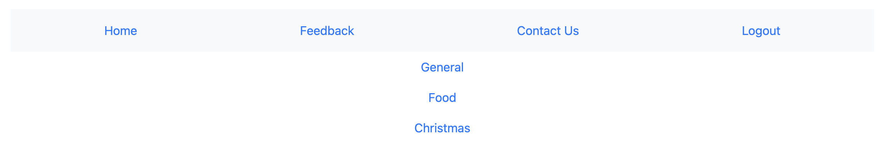
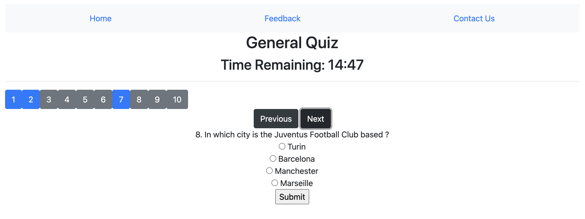
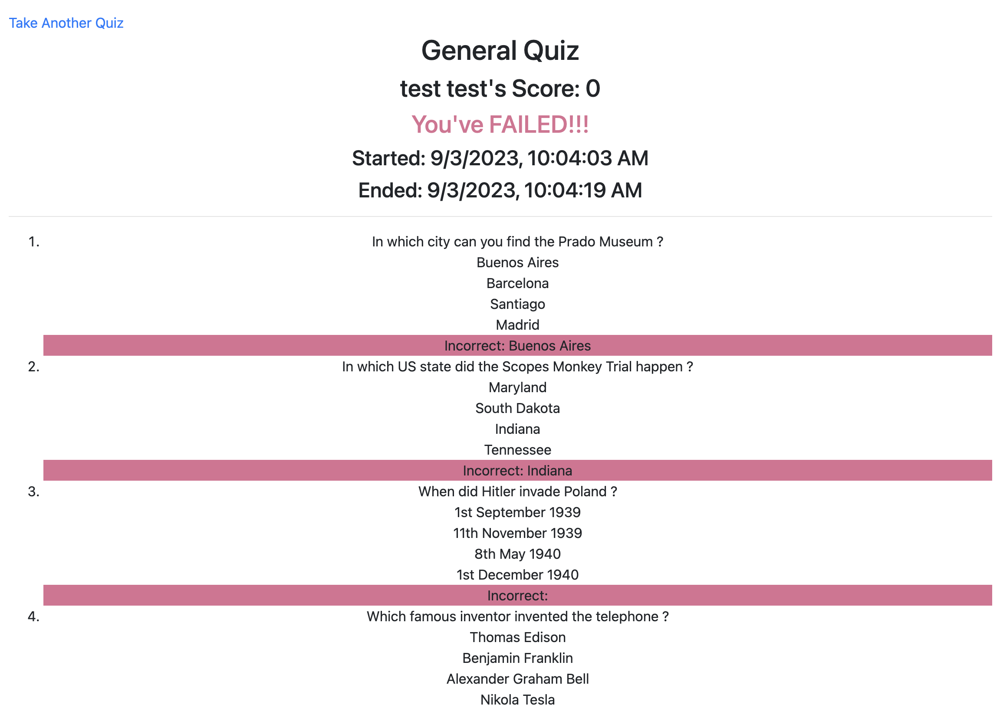
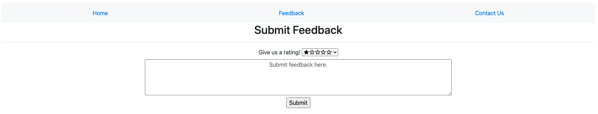
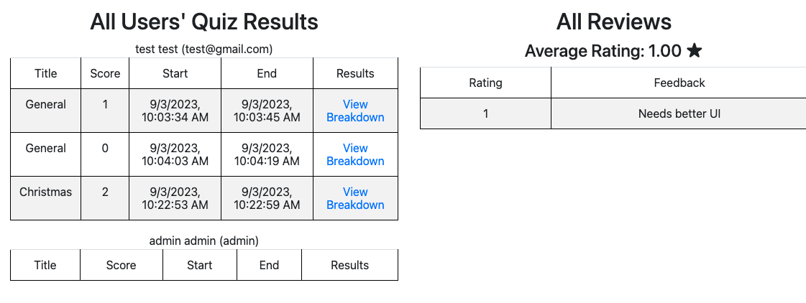

<h1 align="center">
Simple Quiz
</h1>

> A Node.js, SSR-rendered web application that lets users select from 3 different quizzes, which will generate a random selection of 10 multiple-choice questions. Upon finishing the quiz, they'll be able to see a results page that highlights their correct and incorrect answers. They can leave feedback on the quizzes, and admins can view all previously submitted quizzes.

- [Images](#images)
- [Technologies](#technologies)
- [Features](#features)
- [Set-up (locally)](#set-up-locally)

## Images







## Technologies

- HTML, CSS, Bootstrap, JS, Handlebars, Node.js (MVC), MongoDB, Mongoose

## Features

1. Registration Page
   - Before taking a quiz, a user have to first register and login. To register one can directly click on the register menu or a link to registration page is provided on the login page to create an account.
2. Login Page
   - When a user clicks, an exam user is directly redirected to the login page, if the user is not logged in.
   - Login Page should be the default page when user enters the application
3. Home Page
   - List of different type quiz that the application provides
   - At least 3 types of quiz problem
   - Each quiz has 10 questions
4. Quiz Screen
   - Multi choice questions
   - Each quiz last at most 15 minutes
     - If user exceeds the time limit, show an alert and force to submit the quiz
   - An navigator to jump to different questions
     - Different styles for answered questions and available questions
   - Previous and Next button to previous and next question
     - If user is on first question, there is no previous button
     - If user is on last question, there is no next button
   - Submit button on all questions
     - If user doesn’t answer all questions, show an alert with Yes or No
     - If user clicks Yes, the submit the quiz anyway
     - If user clicks No, hide the alert
5. Quiz Result
   - Show Quiz name
   - Show User full name
   - Show Starting time and end time
   - Show the result of each multi choice question
   - If user answers no less than 6 question correctly, the user passes the quiz. Otherwise, user fails the quiz
   - Take another quiz link to the home page
6. Feedback
   - User can submit feedback to the application
   - Provide Start rating function — 5 star is the max
   - Text boxes for user feedback
   - Feedback should be anonymous
7. Global Nav
   - Home, Feedback, Contact Us
8. Admin Page
   - View different users
   - Check the answer for short answer questions of each user
   - View the feedback

- Questions are assigned in random order to each quiz, and the contents are copied from online. See `/initdb.js`
- There is up to 20 unique questions per quiz, 10 of which are randomly assigned when you take it.

## Set-up (locally)

- `npm install` in the root directory
- Create a `.env` with the following properties:

```bash
DB_URI=""
PORT=""
JWT_KEY=""
```

- Add your MongoDB connection URI for `DB_URI` and anything you want for the port, jwt_key.
- Run `node initdb.js` to populate the database with quiz questions, which will let you view the list of quizzes and start taking them.
- Run `npm test.js` to start up the application.
- Visit the localhost url that is outputted in the terminal.
- Register an account through the website.
  - Log in with this account to start using the application.
- Register another account, say username/pw is admin/admin.
  - Go to the MongoDB console and manually change the status to `isAdmin: true`.
  - Log in with this new admin account to view all quiz results.
